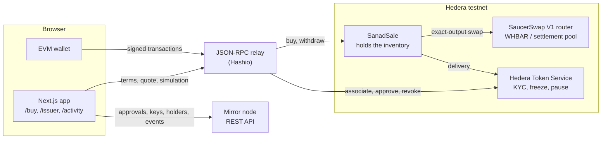
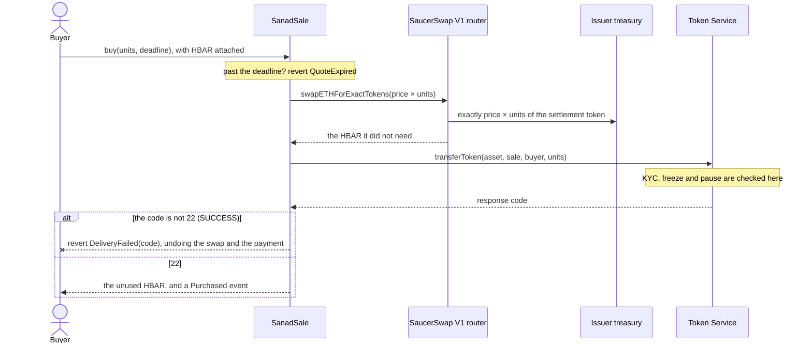

# Sanad

Sell a **permissioned** asset on Hedera for HBAR, in a single transaction.

The buyer pays HBAR. SaucerSwap V1 converts exactly enough of it into the issuer's settlement
token and pays the issuer. The asset is then delivered from the sale contract's inventory, and the
Hedera Token Service decides whether that delivery is allowed using the token's own KYC, freeze and
pause rules. If the network refuses, the swap and the payment are undone with it. There is no state
in which the buyer has paid and not been served.

_Sanad_ (سند) is Arabic for a deed or title: the document that says a thing is yours.

## Who this is for

You are issuing something that not everyone is allowed to hold: a fund unit, a regulated
instrument, a membership. You want buyers to pay in HBAR, you want to be paid in a stable unit, and
you need the "is this buyer allowed?" check to be enforced by the ledger rather than by your
frontend. Sanad is the smallest correct starting point for that, meant to be forked and changed.

## Quickstart

```bash
npm create scaffold-hbar@latest my-sanad -- --template farouk-allani/template-hedera-sanad
```

The `--` is required. Without it npm keeps `--template` for itself and the CLI never sees it, which
silently gets you the default template instead of this one.

```bash
cd my-sanad
yarn next:start               # then open http://localhost:3000
```

The app opens on a live demo sale on Hedera testnet, so there is something real to look at before
you deploy anything. Connect a wallet on Hedera Testnet to associate and see the approval step;
finishing a purchase needs the sale's compliance wallet to approve you, which is the point. To run
the whole flow yourself, deploy your own sale: see [Try it on testnet](#try-it-on-testnet).

Yarn is the default. `--package-manager npm` also works; the scripts set environment variables
through `cross-env` so they run the same on Windows, macOS and Linux.

## Prerequisites

- [Node.js](https://nodejs.org/) 20.18.3 or later
- Yarn 3 via Corepack (`corepack enable`), or npm 10+ if you scaffold with `--package-manager npm`
- Git with `user.name` and `user.email` set; the scaffold CLI refuses to run without them
- For your own sale on testnet: an **ECDSA** account from the
  [Hedera Portal](https://portal.hedera.com). It starts with 1,000 test HBAR and can draw up to
  1,000 a day, and setup spends about 200. The anonymous [faucet](https://portal.hedera.com/faucet)
  gives 100, which is plenty for a buyer's wallet but not enough for setup.
- A browser wallet that can add a custom network, such as MetaMask

## Environment variables

Each package reads its own `.env`, next to its `package.json`. Copy the `.env.example` beside it and
fill that in; a `.env` at the repository root is not read by anything. The app needs none of these
to run against the demo sale. Running your own sale needs one: `OPERATOR_KEY`, or an encrypted key.

**`packages/hardhat/.env`**

| Variable | Default | Read by | What it does |
|---|---|---|---|
| `OPERATOR_KEY` | none | `sanad:setup`, `sanad:deploy`, `sanad:test` | The issuer's ECDSA testnet key, hex or DER. Refused for any network other than testnet. |
| `DEPLOYER_PRIVATE_KEY_ENCRYPTED` | none | `sanad:*`, `hardhat:deploy`, `hardhat:account` | Written by `yarn hardhat:account:generate` or `yarn hardhat:account:import`, and unlocked with a password. Use it for any key that holds real value. |
| `HEDERA_RPC_URL` | `https://testnet.hashio.io/api` | `hardhat:test`, `hardhat:chain` | The endpoint the local test network forks from. It does not change where anything is deployed: the `hederaTestnet` and `hederaMainnet` networks have their own URLs in `hardhat.config.ts`. |
| `HEDERA_MIRROR_TESTNET_URL` | `https://testnet.mirrornode.hedera.com` | `sanad:setup`, `sanad:deploy`, `sanad:test` | The mirror node the scripts read accounts, tokens and results from. |
| `SAUCERSWAP_V1_ROUTER_ID` | `0.0.19264` | `sanad:setup`, `sanad:deploy` | The SaucerSwap V1 router the sale swaps through. Setup records it with the deployment. |
| `SANAD_ASSET_ID`, `SANAD_SETTLEMENT_ID`, `SANAD_PRICE`, `SANAD_INVENTORY`, `SANAD_TREASURY` | none | `sanad:deploy` | The sale to deploy for tokens you already have. See [Customising it for your asset](#customising-it-for-your-asset). |

**`packages/nextjs/.env`**

| Variable | Default | Read by | What it does |
|---|---|---|---|
| `NEXT_PUBLIC_WALLET_CONNECT_PROJECT_ID` | the scaffold's shared ID | the wallet connectors | Fine on your own machine. Create your own at [cloud.reown.com](https://cloud.reown.com) before you put the app anywhere public. |
| `NEXT_PUBLIC_HEDERA_TESTNET_RPC_URL` | `https://testnet.hashio.io/api` | contract reads and simulations | The JSON-RPC endpoint the app reads testnet through. Transactions go through the wallet's own RPC. |
| `HEDERA_MIRROR_TESTNET_URL` | `https://testnet.mirrornode.hedera.com` | `/api/hedera/account` | The server route that shows a connected wallet's account ID. Sanad's screens call the mirror node from the browser, through `MIRROR_NODE_URL` in `utils/sanad/mirror.ts`. |

The scripts set `__RUNTIME_DEPLOYER_PRIVATE_KEY`, `HEDERA_FORKING` and `REPORT_GAS` themselves; do not
set them by hand. Upstream's hosting helpers also read `NEXT_PUBLIC_IGNORE_BUILD_ERROR`,
`NEXT_PUBLIC_IPFS_BUILD` and `VERCEL_PROJECT_PRODUCTION_URL`, which Sanad does not need.

## Architecture



There is no server. The app reads the sale's fixed terms and the live quote from the contract, and
everything the token itself decides (who is approved or frozen, whether it is paused, who holds
which key, who has associated) from the mirror node, because the contract knows none of it. Every
change is a transaction the connected wallet signs: a buyer's association and purchase, the
compliance wallet's approvals, the owner's withdrawals.

`SanadSale` holds the inventory and knows five things, all fixed at construction: the router, the
asset, the settlement token, where the issuer is paid, and the price per unit. It has no admin
switch to change them, so the terms a buyer sees cannot be edited underneath them.

**`packages/hardhat`**

- `contracts/SanadSale.sol` is the sale. `contracts/interfaces/` holds the parts of the Token Service
  and the SaucerSwap router it calls, and `contracts/mocks/` a router that stands in for SaucerSwap
  in local tests.
- `scripts/sanad/setupTestnet.ts` is `yarn sanad:setup` and `scripts/sanad/deploySale.ts` is
  `yarn sanad:deploy`; `scripts/sanad/hedera.ts` holds what they share with the acceptance suite.
  `scripts/runSanadWithPK.ts` hands the key to hardhat.
- `test/SanadSale.test.ts` is the local suite (`yarn hardhat:test`, no HBAR);
  `test-testnet/SanadSale.acceptance.ts` is the testnet suite (`yarn sanad:test`).
- `deployments/hederaTestnet/SanadSale.json` records the sale the app points at.
- `HederaToken.sol`, `HtsTokenCreator.sol`, `deploy/` and their tests are Scaffold-HBAR's own
  examples, as upstream ships them. Sanad does not use them.

**`packages/nextjs`**

- `app/buy`, `app/issuer` and `app/activity` are the three screens, `app/page.tsx` the landing page,
  and `app/debug` upstream's contract debugger.
- `hooks/sanad/` reads the sale and its events, reads the mirror node, works out what the connected
  wallet is allowed to do (`useWalletRoles`), and sends the Token Service calls (`useHtsCalls`).
- `utils/sanad/` holds the mirror node routes, the response codes, and every error message a user
  can see (`errors.ts`).
- `contracts/deployedContracts.ts` is generated from `deployments/`. Do not edit it by hand.

## Try it on testnet

```bash
cp packages/hardhat/.env.example packages/hardhat/.env   # then set OPERATOR_KEY
yarn sanad:setup              # tokens, compliance account, buyers, pool, contract, inventory
yarn sanad:test               # the acceptance suite, against real testnet
```

`OPERATOR_KEY` is the private key of an ECDSA account from the
[Hedera Portal](https://portal.hedera.com), hex or DER-encoded, whichever the Portal shows you. It
is used as-is so testnet costs you no password prompts, and it is refused for any network other
than testnet. For anything holding real value, leave it empty and use
`yarn hardhat:account:import`, which keeps the key encrypted and asks for a password.

The app ships pointed at a live demo sale on testnet (the one under
[Testnet evidence](#testnet-evidence)), so it works before you deploy anything. `sanad:setup` deploys
your own and points the app at it instead.

`sanad:setup` spends real testnet HBAR, most of it seeding the pool. It checkpoints every step that
costs something, so a run that fails partway resumes instead of paying twice.

The demo's keys, one per token role plus the two buyers', are written to
`packages/hardhat/.sanad/testnet.keys.json`, which is gitignored. Setup also creates an account
controlled by the KYC key, because approving a buyer means signing with that key; the next section
shows how to use it from a browser wallet. It is a throwaway testnet key. In production the KYC key
belongs to whoever actually carries out compliance, on their own device.

What it costs, measured on testnet in September 2026. Hedera prices fees in US dollars and charges
the HBAR equivalent at the current exchange rate, so these move with the rate.

| Action | Cost |
|---|---|
| `sanad:setup` | About 200 HBAR: the SaucerSwap pool-creation fee (25.95 HBAR on 22 September), 100 HBAR of pool liquidity, 30 HBAR for each of the two demo buyers, 5 for the compliance account, and gas |
| A buyer associating with the asset, once | 0.79 HBAR |
| Approving or revoking a buyer | 0.04 HBAR |
| A purchase | 0.21 HBAR in fees, plus the HBAR the pool takes for the settlement amount |

### Your first purchase in the browser

After `sanad:setup`, the app points at your sale and you hold every key it made. A purchase needs two
wallets, because the buyer and the person who approves buyers are different people.

1. **Add Hedera Testnet to your wallet**: network name `Hedera Testnet`, RPC URL
   `https://testnet.hashio.io/api`, chain ID `296`, currency `HBAR`, block explorer
   `https://hashscan.io/testnet`.
2. **The compliance wallet.** Import the `kyc` key from `packages/hardhat/.sanad/testnet.keys.json`
   into your wallet as a new account. It is the account setup created for the KYC key, with 5 HBAR,
   enough for about a hundred approvals.
3. **The buyer wallet.** Create a new account in your wallet and paste its address into the
   [faucet](https://portal.hedera.com/faucet). Hedera creates an account for the address when the
   100 HBAR arrives; buying one unit costs about 2 HBAR in all.
4. `yarn next:start`, connect the buyer wallet and open [localhost:3000/buy](http://localhost:3000/buy).
   Step 1, **Associate**, is one transaction of about 0.8 HBAR. It is also the transaction that
   completes the account the faucet created, which until then has no key on record.
5. Step 2 shows your account ID and a link to the issuer console that opens on it. Switch your
   wallet to the compliance account, open that link and press **Approve**. The console waits until
   the mirror node shows the approval before it reports it.
6. Switch back to the buyer. `/buy` notices the approval within ten seconds. Choose the units and a
   price tolerance and press **Buy**. The page simulates the purchase first, so a refusal is
   explained before you sign anything. The receipt shows what the pool took, what came back to you,
   and what the issuer received, with a link to the transaction on HashScan.

`/activity` then lists the purchase. To skip steps 3 to 5, import `buyer.approved` from the same
file instead: setup has already associated and approved it. To try inventory withdrawal on
`/issuer`, connect the account whose key is `OPERATOR_KEY`; it deployed the sale, so it owns it.
These are throwaway testnet keys. Do not reuse them anywhere else.

## The purchase flow

A buyer cannot simply be sent a permissioned token. The order matters, and two of the three steps
are not the sale at all:

1. **Associate.** The buyer associates their account with the asset. Hedera requires this before an
   account can hold any balance of a token.
2. **Approve.** The issuer grants KYC, signed by the KYC key. This can only happen *after*
   association — `TokenGrantKyc` on an unassociated account resolves to
   `TOKEN_NOT_ASSOCIATED_TO_ACCOUNT`.
3. **Buy.** `buy(units, deadline)` with HBAR attached. Inside one transaction: SaucerSwap converts
   exactly enough HBAR to pay the issuer the settlement amount, the asset moves from inventory to
   the buyer, and the unused HBAR goes back. The network checks the token's rules during the second
   of those. If it refuses, the first is undone with it.



In the app, `/buy` walks a buyer through the three steps in that order and shows where they stand.
Association needs no Hedera SDK and no special wallet: every HTS token answers `associate()` at its
own address ([HIP-719](https://hips.hedera.com/hip/hip-719)), so any EVM wallet can send it. The
page quotes live from the pool, sets the maximum spend to the quote plus a tolerance the buyer picks
(0.5, 1 or 3 per cent), and sets the deadline two minutes after Buy is pressed; the contract enforces
both. Before asking the wallet to sign, it simulates the purchase as the buyer. Every refusal the
network would make, whether not approved, frozen, paused or the price moved past the maximum, shows
up in that simulation, so the page explains it before anything is paid.

`/activity` lists what the sale contract recorded, every purchase and every withdrawal, each linked
to its transaction on HashScan, and where every buyer stands now. Approvals and revocations have no
history there. They are token operations rather than sale events, and the mirror node cannot list
them by token, because its record of each one names the account, not the asset. A history of them
would need a log of its own, such as a Hedera Consensus Service topic written alongside each change.

## What is guaranteed, and by whom

The distinction matters, because only one of these two lists survives a bug in the frontend.

**The ledger enforces these.** They hold against a direct contract call, a modified frontend, or a
buyer scripting against the contract:

- An unapproved or frozen buyer cannot receive the asset. Delivery is an HTS transfer, and HTS
  applies the token's KYC, freeze and pause rules itself.
- A paused token stops every transfer, including ours.
- Token supply cannot be inflated by this contract: it has no supply key.

**The sale contract enforces these.** They are only as good as the code, which is why the tests
assert balances rather than error names:

- Settlement is exact. The issuer receives the full price or the purchase reverts.
- Delivery failure reverts the payment. Every HTS response code is checked.
- The buyer never spends more than the HBAR they attached, and gets the remainder back.
- A quote past its deadline is refused before the pool is touched.
- Only the issuer can withdraw inventory or recover HBAR.

## Key custody

The setup script gives each role its own key, because collapsing them hides what the issuer can
actually do. All six are written to a gitignored file for the demo; in production they belong in
separate custody.

| Key | Who should hold it | What the holder can do, without asking the sale contract |
|---|---|---|
| Admin | Issuer | Change the token's other keys, including replacing all of the below |
| KYC | Compliance. In the demo, the account setup creates for it, so a browser wallet can sign | Approve or un-approve any account, at any time |
| Freeze | Compliance | Freeze a holder, blocking transfers in and out |
| Pause | Compliance | Halt every transfer of the token at once |
| Wipe | Compliance | Burn units from a holder. This destroys them; it does not return them to the issuer |
| Supply | Issuer | Mint or burn supply. `SanadSale` deliberately does not hold this |
| Treasury | Issuer account | Receive settlement, and hold unsold supply |

The sale contract holds **none** of these. It is an ordinary account that happens to be associated
and approved, so the issuer can revoke its KYC and stop sales without touching the contract.

The issuer console, `/issuer`, reads these keys from the ledger and names the account holding each
one where it can: the ledger links a key to an account only when an account uses it as its own key.
Before offering anything, the console works out which of two authorities the connected wallet has.
Approving a buyer takes the KYC key; withdrawing inventory takes the sale's owner, the account that
deployed it. They are usually different wallets, and the console names the one to connect.

Buyers are found through association, the one on-chain step a buyer takes before approval, which
Hedera requires anyway. The console lists every account associated with the asset, apart from the
treasury and the sale itself, with each one's standing. Anyone can associate, so the list shows who
asked, not who has been checked: checking who a buyer is happens outside the ledger, and approving
records the decision on it. A buyer can also send their account ID, or a link that opens the console
on their account.

## Why SaucerSwap, and why not just pay in the stablecoin

Because the two sides want different things. The buyer holds HBAR and does not want to go and
acquire a stablecoin first; the issuer needs to be paid in a stable unit and does not want price
risk between quote and settlement. Doing the conversion inside the purchase means the buyer spends
HBAR, the issuer receives exactly the settlement amount, and neither has to trust the other to
convert. If your buyers already hold your settlement token, Sanad's swap is a detour you do not
need.

## Hedera traps this template handles

Hedera's EVM differs from Ethereum's in ways that cost real money to discover. Each of these was hit
or checked while building Sanad, and each is handled in the code.

- **The Hedera Token Service reports a refusal as a return value, not a revert.** A contract that
  ignores the code keeps the buyer's HBAR and delivers nothing. `SanadSale` checks every code and
  reverts with it, as `DeliveryFailed(code)`.
- **A KYC change sent from the wrong wallet "succeeds".** `grantTokenKyc` sent to `0x167` by a wallet
  without the KYC key gives a successful transaction that returned 7, `INVALID_SIGNATURE`, and a
  simulation reports success too (see the evidence table). The console checks the wallet's key
  before offering an approval and confirms every change on the mirror node.
- **KYC can only be granted to an associated account.** So association comes first even for an
  account with unlimited automatic associations, which only associates when a token arrives.
- **An unassociated buyer is refused with 176, not 184,** when the account allows unlimited automatic
  associations, the default for accounts created by sending HBAR to an EVM address
  ([HIP-904](https://hips.hedera.com/hip/hip-904)). The app reads association from the mirror node
  instead of inferring it from the error code.
- **An account with an ECDSA alias must be addressed by its alias.** HTS refuses its long-zero
  address with `INVALID_ALIAS_KEY` (282). The issuer's treasury and every KYC call use the alias.
- **HBAR has two decimal systems.** Inside a contract, `msg.value` and balances are tinybars (8
  decimals); wallets and the JSON-RPC relay use weibars (18). Some Hedera documentation pages say a
  contract sees 18; the purchases in the evidence table settle to the tinybar with 8. The app
  converts in one place, `WEIBARS_PER_TINYBAR`.
- **SaucerSwap has two WHBAR addresses.** `WHBAR()` is the wrapper contract and `whbar()` the HTS
  token. A swap path must start with the token, or the router reverts with `INVALID_PATH`.
- **The router refunds its caller, not the buyer.** In an exact-output swap made by a contract, the
  unused HBAR comes back to the contract, so `SanadSale` forwards it in the same transaction.
- **`receive()` does not run for native HBAR transfers,** so a contract's balance can change without
  its code running. `sweepHbar` exists for HBAR that arrives that way.
- **The mirror node trails consensus by a few seconds.** A read straight after a transaction can be
  stale, so the app waits for the mirror node to show a change before reporting it.
- **Creating a SaucerSwap pool takes about 6.8 million gas.** Below that, `addLiquidityETHNewPool`
  fails inside an association. Setup gives it 9 million.

## Customising it for your asset

**Change the demo.** `CONFIG` at the top of `packages/hardhat/scripts/sanad/setupTestnet.ts` sets the
price, the supply, the opening inventory, how much each side puts into the pool, and what the demo
accounts are funded with. Every `sanad:setup` creates new tokens, so a change takes effect on the next
run. The pool's depth is the one to think about: the swap moves the price along the pool's curve, so
a shallow pool makes large orders expensive, and an order for more settlement than the pool holds
cannot be filled at any price.

**Sell your own asset.** `yarn sanad:deploy` deploys a sale for tokens that already exist, rather
than creating demo ones. Set these in `packages/hardhat/.env`:

```bash
SANAD_ASSET_ID=0.0.1234        # what you sell: an HTS fungible token with 0 decimals
SANAD_SETTLEMENT_ID=0.0.5678   # what the issuer is paid in
SANAD_PRICE=10                 # one unit, in whole settlement tokens (2.5 works too)
SANAD_INVENTORY=100            # units the sale should hold, moved from your account
# SANAD_TREASURY=0.0.9012      # who is paid; defaults to your account
```

It checks everything it can before it spends anything: that the asset has no decimals (the contract,
the quote and the app all count whole units), that SaucerSwap V1 has a pool between WHBAR and the
settlement token, and that the account being paid is associated with the settlement token and
allowed to receive it. Then it deploys the sale, associates it with the asset, moves the inventory in
and points the app at it.

If the asset has a KYC key, the sale contract itself has to be approved before it can hold any units,
and the script never holds that key. It stops and prints a link to the issuer console that opens on
the sale's account. Whoever holds the KYC key presses **Approve** there, and running
`yarn sanad:deploy` again finishes the job. Running it again with the same settings is always safe:
it reuses the deployed sale and only tops the inventory up to `SANAD_INVENTORY`.

**Settle in a real stablecoin.** `sUSD` is a demo token that setup mints for itself. It is not a
stablecoin and is not redeemable for anything. To be paid in a real one, pass its token ID as
`SANAD_SETTLEMENT_ID`. The only requirement Sanad adds is a SaucerSwap V1 pool against WHBAR, deep
enough for your largest order. On testnet that rules out every USDC we could find: in September 2026
six tokens used the symbol `USDC` and none had a WHBAR pool, which is why the demo seeds its own.

**Point the app at a sale.** `sanad:setup` and `sanad:deploy` both rewrite two files:
`packages/nextjs/contracts/deployedContracts.ts` and
`packages/hardhat/deployments/hederaTestnet/SanadSale.json`. Commit both, and your fork ships
pointed at your sale. The second is committed on purpose: the frontend's contract list is rebuilt
from `deployments/` on every deploy, so a sale whose record is not there disappears from the app.

The app manages one sale at a time. Before you replace a sale, take its unsold inventory back from
`/issuer`: once the app points elsewhere, the old sale only appears in the console as one more
account associated with the asset.

**What not to change.** `AGENTS.md` lists the invariants that keep the sale correct. Among them:
every Token Service response code is checked, the sale contract never checks KYC itself, settlement
and delivery stay in one transaction, aliased accounts are addressed by their alias, and unsold
inventory can always be withdrawn. They apply to people as much as to coding agents.

### Running it on mainnet

Sanad ships for testnet only, and we have not run it on mainnet. The contract is the same on both
networks; the configuration changes, and so does what a mistake costs. **`SanadSale` has not been
audited.** Have it audited before it holds anything of value.

These mainnet values were read from the chain on 26 September 2026, not copied from memory:

| | Mainnet | Testnet |
|---|---|---|
| SaucerSwap V1 router | `0.0.3045981` | `0.0.19264` |
| WHBAR token, what the router's `whbar()` returns | `0.0.1456986` | `0.0.15058` |
| Mirror node | `https://mainnet.mirrornode.hedera.com` | `https://testnet.mirrornode.hedera.com` |
| JSON-RPC relay, chain ID | `https://mainnet.hashio.io/api`, 295 | `https://testnet.hashio.io/api`, 296 |
| HashScan | `https://hashscan.io/mainnet` | `https://hashscan.io/testnet` |

Hedera's documentation describes Hashio as a beta for testing, so use a production relay provider on
mainnet. For settlement, native USDC (`0.0.456858`, 6 decimals, no KYC key) has a V1 pool against
WHBAR, holding about 2.85 million WHBAR and 269,000 USDC that day; USDT0 (`0.0.10282787`) has none.
USDC has a freeze key, so if its issuer froze your treasury, every purchase would revert at the
payout.

What has to change, all of it configuration:

| Where | What |
|---|---|
| `packages/nextjs/scaffold.config.ts` | `targetNetworks` to `[chains.hedera]`, and `rpcOverrides` to your mainnet relay |
| `packages/nextjs/utils/sanad/mirror.ts` | `MIRROR_NODE_URL` |
| `packages/nextjs/utils/sanad/format.ts` | `HASHSCAN_URL` |
| `packages/nextjs/components/ScaffoldHbarAppWithProviders.tsx`, `components/sanad/SaleGate.tsx` | `hederaTestnet` to `hedera` |
| `app/page.tsx`, `app/buy/_components/BuyFlow.tsx`, `app/issuer/_components/BuyersPanel.tsx`, `components/sanad/SaleGate.tsx` | text that says "Hedera Testnet" or sends buyers to the faucet |
| `packages/hardhat/scripts/sanad/hedera.ts` | `Client.forTestnet()` in `issuer()`, and the `hashscan` helper. `HEDERA_MIRROR_TESTNET_URL` and `SAUCERSWAP_V1_ROUTER_ID` take the mainnet values from `.env`; only their names say testnet |
| `packages/hardhat/package.json` | a copy of `sanad:deploy` with `--network hederaMainnet`. Never `sanad:setup`, which mints demo tokens and seeds a pool with your HBAR |
| `packages/hardhat/.gitignore` | un-ignore `deployments/hederaMainnet/` as `hederaTestnet` is, or the next deploy drops the sale from the app |

Keys matter more here than anything above. `OPERATOR_KEY` is refused for any network but testnet;
use `yarn hardhat:account:import`, which keeps the key encrypted and asks for its password on every
run. The account that deploys owns the sale and can withdraw all of its inventory. The KYC key can
approve anyone, so it belongs to whoever carries out compliance, on a device of its own, and never
on the machine that deploys.

## Honest limits

- `SanadSale` has not been audited. Its guarantees are backed by the tests and the testnet evidence
  below, which is not the same thing.
- Granting the KYC flag is a demo approval. It verifies nobody's identity and is not a
  compliance process.
- Token controls are not legal compliance. A freeze key is not a court order.
- Wipe burns units and reduces supply. It is not a clawback that returns them to the issuer.
- The demo settlement token is a test token created by the setup script, clearly labelled as such.
  It is not a real stablecoin and is not redeemable for anything.

## Sanad, Asset Tokenization Studio and Stablecoin Studio

[Asset Tokenization Studio](https://docs.hedera.com/solutions/tokenization/ats/index) and
[Stablecoin Studio](https://docs.hedera.com/solutions/tokenization/stablecoin/index) are full
platforms, with lifecycle management, roles and a UI. Sanad is not competing with them. It is a
template you fork when you want to understand and own the whole path, and it is deliberately small
enough to read in one sitting. If you need a securities platform, use the studios.

## Testnet evidence

Runs of the acceptance suite on Hedera testnet, 22 and 23 September 2026, against one deployment.
Sale contract [`0.0.10667622`](https://hashscan.io/testnet/contract/0.0.10667622), asset `SDFU`
[`0.0.10667614`](https://hashscan.io/testnet/token/0.0.10667614), settlement `sUSD`
[`0.0.10667613`](https://hashscan.io/testnet/token/0.0.10667613), at 10 sUSD per unit.

| What it shows | Result | Transaction |
|---|---|---|
| A purchase settles and delivers | `SUCCESS`, 226,422 gas | [`0x7efd…fbb7`](https://testnet.mirrornode.hedera.com/api/v1/contracts/results/0x7efd4a8982c94964a00eabebaa93ce89510d5a13418371404a9eb64f1268fbb7) |
| Buyer without KYC: delivery refused, swap undone | `DeliveryFailed(176)`, 188,431 gas | [`0xa41e…3c1b`](https://testnet.mirrornode.hedera.com/api/v1/contracts/results/0xa41ec414917b837e59a51be7c8a98b812fd9189a7b15ecb990bf94312e633c1b) |
| Frozen buyer: same, after approval | `DeliveryFailed(165)` | [`0x7f17…0d96`](https://testnet.mirrornode.hedera.com/api/v1/contracts/results/0x7f174259efcf5a2b99583d91800782f663df92e1321bdf590c1835c3f4f10d96) |
| Budget below the price: pool refuses | `EXCESSIVE_INPUT_AMOUNT` | [`0xd4d1…72d8`](https://testnet.mirrornode.hedera.com/api/v1/contracts/results/0xd4d1c90d93abff30235f32cd6a01d632f4959344996c054a5033064192ef72d8) |
| Expired quote: refused before the pool | `QuoteExpired` | [`0x6555…4e1b`](https://testnet.mirrornode.hedera.com/api/v1/contracts/results/0x6555d579b4ba06867d6d4e7b245843c75c4aca4e1e231ce29b4322f5eaba4e1b) |
| Issuer withdraws unsold inventory | `SUCCESS` | [`0xee97…68f5`](https://testnet.mirrornode.hedera.com/api/v1/contracts/results/0xee9774325942019b2a5d8b9a8116fe0a3686cc2184118e6415986a8311f768f5) |
| Paused asset: delivery refused, swap undone | `DeliveryFailed(265)` | [`0xad79…2d40`](https://testnet.mirrornode.hedera.com/api/v1/contracts/results/0xad79d104d759095377c2ac79fea3e3465376c674c63eff1aa8678dda4f022d40) |
| Compliance wallet approves a buyer from a plain EVM wallet | `SUCCESS`, returned 22 | [`0x9251…2a3e`](https://testnet.mirrornode.hedera.com/api/v1/contracts/results/0x925168f2f9a3564e6e4ddc24694e8697137d3d1c53c0ad9f9779a4f837692a3e) |
| … and revokes the approval | `SUCCESS`, returned 22 | [`0xd11f…6d8f`](https://testnet.mirrornode.hedera.com/api/v1/contracts/results/0xd11ff3030b5a4d1c75e0da9a0c92a1dd4018525d9e17ffe77a40092df7ff6d8f) |
| A wallet without the KYC key tries to approve itself | `SUCCESS`, returned **7**, nothing changed | [`0xcd66…df6a`](https://testnet.mirrornode.hedera.com/api/v1/contracts/results/0xcd664f18de80e360c97064a1333f5a433ae175939f92037f0ee34e356714df6a) |

The second row is the one worth checking. The swap had already executed inside that call; HTS then
refused the delivery and the contract turned that response code into a full revert. Right after that
first run, the ledger showed the refused buyer holding **0** units with `kyc_status=REVOKED`, while
the approved buyer held **2** and the issuer's sUSD was exactly 20 higher: two units at ten. Nothing
settled halfway.

Note that a rollback is **not** provable from the transaction's `token_transfers` being empty: HTS
movements inside a contract call are not recorded on the parent record, so that field is empty for
a successful purchase too. Balances and pool reserves are the evidence, which is what the
acceptance suite asserts.

`sanad:deploy` was checked the same way on 26 September: it deployed a second sale for the same two
tokens at 12 sUSD a unit, [`0.0.10729173`](https://hashscan.io/testnet/contract/0.0.10729173), and
stopped for the KYC key holder. The compliance wallet approved the sale contract from the issuer
console ([`0xd7bf…ba5c`](https://testnet.mirrornode.hedera.com/api/v1/contracts/results/0xd7bf7e2a54c41a51759427ec931b38cdeac45e16c439cf4aee89d1ff13daba5c)),
a second run stocked it, a buyer bought one unit from `/buy` and the issuer received exactly 12 sUSD
([`0x5900…eede`](https://testnet.mirrornode.hedera.com/api/v1/contracts/results/0x5900c61ad913d0e5c16da2291bd3a8c44729f8368d64f62cfb6f40d476a8eede)),
and the owner took the rest back from `/issuer`
([`0xc6ad…1b00`](https://testnet.mirrornode.hedera.com/api/v1/contracts/results/0xc6ad5ff64ec9dde6a181d1564df75685cbe5c14c866882bad28b0fa6009c1b00)).

## Troubleshooting

Every one of these was hit while building or testing Sanad.

| What you see | Why | What to do |
|---|---|---|
| The new project has no `SanadSale.sol`; it is plain Scaffold-HBAR | `npm create` ran without `--` before `--template`, so npm kept the flag and the CLI used its default template | Scaffold again with `-- --template farouk-allani/template-hedera-sanad` |
| `corepack enable` fails with a permission error on Windows | It writes next to Node, in Program Files | Run it from an administrator shell, or pass `--install-directory` with a folder on your `PATH`, such as npm's `%APPDATA%\npm` |
| A plain `npm install` fails with `ERESOLVE` about `@nomicfoundation/hardhat-verify` and `hardhat` | A peer range inherited from upstream. The scaffold CLI installs with `--legacy-peer-deps`; a plain install does not | `npm install --legacy-peer-deps` |
| `OPERATOR_KEY is an ED25519 key` | EVM transactions can only be signed by an ECDSA (secp256k1) key | Create an ECDSA account on the Portal and use its key |
| `sanad:setup` stopped partway, for example out of HBAR | Every step that costs something is recorded in `packages/hardhat/.sanad/testnet.partial.json` as soon as it succeeds | Top up and run it again. It resumes and does not pay twice. Deleting that file starts over and pays again |
| A `[DEP0190] DeprecationWarning` about `shell` when a script starts on Windows | Node 24 flags how the scripts start hardhat on Windows | Nothing. It is a warning, not an error |
| The app says **No sale found on Hedera Testnet** | Nothing is deployed at the address the app points at, usually because testnet was reset | `yarn sanad:setup`, or `yarn sanad:deploy`, points the app at a new sale |
| `/buy` says your address **has no Hedera account yet** | An EVM address becomes a Hedera account when HBAR first arrives at it | Send it HBAR from the [faucet](https://portal.hedera.com/faucet), then come back |
| `/issuer` offers no **Approve** button | The connected wallet's key is not the asset's KYC key. The console names the account that holds it | Connect that account; in the demo it is the `kyc` key from `.sanad/testnet.keys.json` |
| The console reported an approval, but `/buy` still says it is waiting | The mirror node trails consensus by a few seconds, and `/buy` checks every ten | Wait for the next check |
| A notice appears on `/buy` instead of a purchase | The page checks your standing and the pool before offering **Buy**, and simulates the purchase before asking your wallet to sign. The network would have refused it | The notice says why and what to do: frozen, paused, the pool too small for the order, the price past your tolerance, or the quote expired |
| `sanad:deploy` stops at **Waiting for the holder of the KYC key** | The asset has a KYC key, and the sale contract needs approving like any holder | Approve it from the link it prints, then run it again ([Customising](#customising-it-for-your-asset)) |

## Licence

MIT. See [LICENCE](LICENCE); the upstream Scaffold-HBAR and BuidlGuidl copyrights are kept alongside
Sanad's.
