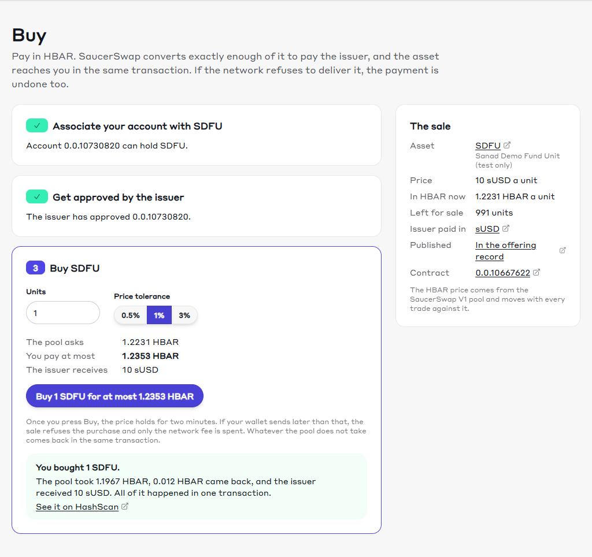
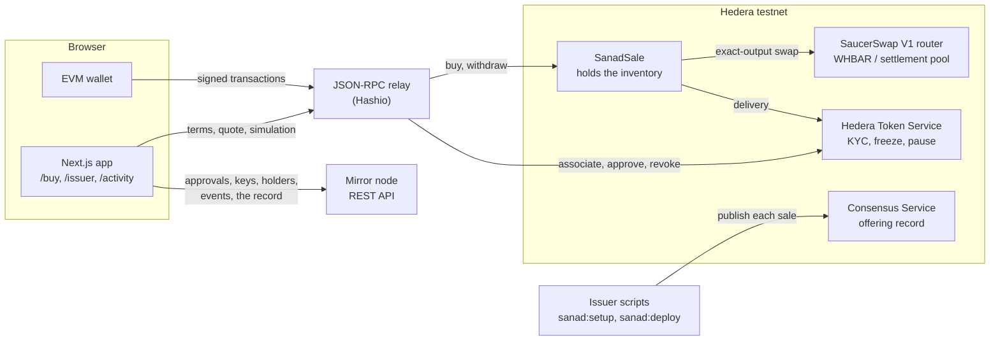
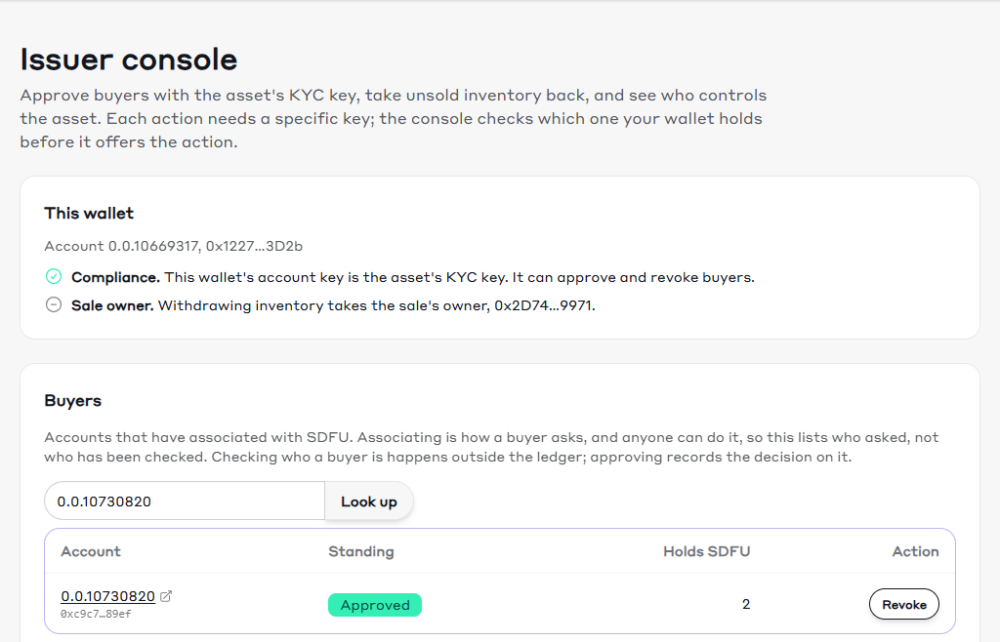
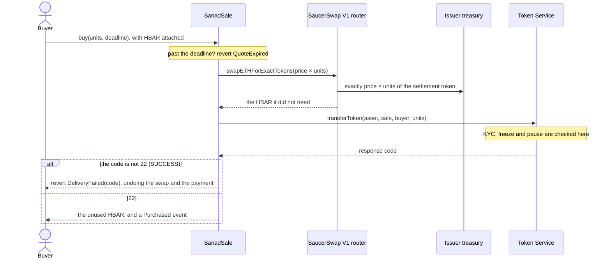
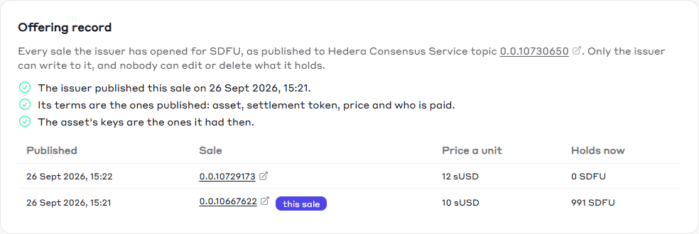

# Sanad

Sell a **permissioned** asset on Hedera for HBAR, in a single transaction.

The buyer pays HBAR. SaucerSwap V1 converts exactly enough of it into the issuer's settlement
token and pays the issuer. The asset is then delivered from the sale contract's inventory, and the
Hedera Token Service decides whether that delivery is allowed using the token's own KYC, freeze and
pause rules. If the network refuses, the swap and the payment are undone with it. There is no state
in which the buyer has paid and not been served.

_Sanad_ (سند) is Arabic for a deed or title: the document that says a thing is yours. Sanad is an
independent project, built on Hedera; it is not affiliated with, sponsored or endorsed by Hedera
Hashgraph, LLC.



## Who this is for

You are issuing something that not everyone is allowed to hold: a fund unit, a regulated
instrument, a membership. You want buyers to pay in HBAR, you want to be paid in a stable unit, and
the "is this buyer allowed?" check has to be enforced by the ledger, not by your frontend. Sanad is
the smallest correct starting point for that, meant to be forked and changed.

## Quickstart

```bash
npm create scaffold-hbar@latest my-sanad -- --template farouk-allani/template-hedera-sanad
```

The `--` matters: without it npm keeps `--template` for itself and you get the CLI's default
template instead. Checked on npm 10.9.0 and 11.20.0; npm 11 warns
`Unknown cli config "--template"`. `npx` needs no `--`:

```bash
npx create-scaffold-hbar@latest my-sanad --template farouk-allani/template-hedera-sanad
```

```bash
cd my-sanad
yarn next:start               # then open http://localhost:3000
```

The app opens on a live demo sale on Hedera testnet. You can connect a wallet and associate, but
buying needs the sale's compliance wallet to approve you, which is the point. To run the whole flow,
deploy your own sale: see [Try it on testnet](#try-it-on-testnet).

Yarn is the default; `--package-manager npm` works too, and the scripts behave the same on Windows,
macOS and Linux.

## Prerequisites

- [Node.js](https://nodejs.org/) 20.18.3 or later
- Yarn 3 via Corepack (`corepack enable`), or npm 10+ if you scaffold with `--package-manager npm`
- Git with `user.name` and `user.email` set; the scaffold CLI refuses to run without them
- For your own sale: an **ECDSA** account from the [Hedera Portal](https://portal.hedera.com). It
  starts with 1,000 test HBAR and setup spends about 200. The anonymous
  [faucet](https://portal.hedera.com/faucet) gives 100: enough for a buyer's wallet, not for setup.
- A browser wallet that can add a custom network, such as MetaMask

## Environment variables

Each package reads the `.env` next to its `package.json`; copy the `.env.example` beside it. A
`.env` at the repository root is read by nothing. The app needs none of these to run against the
demo sale; your own sale needs `OPERATOR_KEY` or an encrypted key.

**`packages/hardhat/.env`**

| Variable | Default | Read by | What it does |
|---|---|---|---|
| `OPERATOR_KEY` | none | `sanad:setup`, `sanad:deploy`, `sanad:test` | The issuer's ECDSA testnet key, hex or DER. Refused for any other network. |
| `DEPLOYER_PRIVATE_KEY_ENCRYPTED` | none | `sanad:*`, `hardhat:deploy`, `hardhat:account` | Written by `yarn hardhat:account:generate` or `yarn hardhat:account:import`, unlocked with a password. Use it for any key that holds real value. |
| `HEDERA_RPC_URL` | `https://testnet.hashio.io/api` | `hardhat:test`, `hardhat:chain` | What the local test network forks from. It does not change where anything is deployed. |
| `HEDERA_MIRROR_TESTNET_URL` | `https://testnet.mirrornode.hedera.com` | `sanad:setup`, `sanad:deploy`, `sanad:test` | The mirror node the scripts read. |
| `SAUCERSWAP_V1_ROUTER_ID` | `0.0.19264` | `sanad:setup`, `sanad:deploy` | The SaucerSwap V1 router the sale swaps through. |
| `SANAD_ASSET_ID`, `SANAD_SETTLEMENT_ID`, `SANAD_PRICE`, `SANAD_INVENTORY`, `SANAD_TREASURY` | none | `sanad:deploy` | A sale for tokens you already have. See [Customising it for your asset](#customising-it-for-your-asset). |

**`packages/nextjs/.env`**

| Variable | Default | Read by | What it does |
|---|---|---|---|
| `NEXT_PUBLIC_WALLET_CONNECT_PROJECT_ID` | the scaffold's shared ID | the wallet connectors | Fine locally. Create your own at [cloud.reown.com](https://cloud.reown.com) before you put the app anywhere public. |
| `NEXT_PUBLIC_HEDERA_TESTNET_RPC_URL` | `https://testnet.hashio.io/api` | contract reads and simulations | Transactions go through the wallet's own RPC. |

The scripts set `__RUNTIME_DEPLOYER_PRIVATE_KEY`, `HEDERA_FORKING` and `REPORT_GAS` themselves.

## Architecture



There is no server. The app reads the sale's terms and the live quote from the contract, and
everything the token decides (who is approved or frozen, whether it is paused, who holds which key,
who has associated) from the mirror node, because the contract knows none of it. Every change is a
transaction the connected wallet signs.

| Part of Hedera | What Sanad uses it for |
|---|---|
| Token Service | The asset's KYC, freeze and pause rules, applied by the network at delivery. Association from any EVM wallet ([HIP-719](https://hips.hedera.com/hip/hip-719)). Approvals through the system contract at `0x167` |
| Smart contracts | `SanadSale`: the swap, the delivery and the refund in one transaction |
| Consensus Service | The [offering record](#the-offering-record): every sale the issuer opens, its terms, and the asset's keys at the time |
| Mirror node | What the token decides, the sale's events and the record |
| SaucerSwap V1 | Turning the buyer's HBAR into exactly the settlement amount, inside the purchase |

`SanadSale` holds the inventory and knows five things, fixed at construction: the router, the asset,
the settlement token, where the issuer is paid, and the price per unit. Nothing can change them, so
the terms a buyer sees cannot be edited underneath them.

**`packages/hardhat`**

- `contracts/SanadSale.sol` is the sale; `contracts/interfaces/` holds the parts of the Token Service
  and the router it calls, and `contracts/mocks/` a router for local tests.
- `scripts/sanad/setupTestnet.ts` is `yarn sanad:setup` and `scripts/sanad/deploySale.ts` is
  `yarn sanad:deploy`; both publish through `scripts/sanad/offeringRecord.ts`, and share
  `scripts/sanad/hedera.ts` with the acceptance suite. `scripts/runSanadWithPK.ts` hands the key to
  hardhat.
- `test/SanadSale.test.ts` is the local suite (`yarn hardhat:test`, no HBAR);
  `test-testnet/SanadSale.acceptance.ts` is the testnet suite (`yarn sanad:test`).
- `deployments/hederaTestnet/SanadSale.json` records the sale the app points at.

**`packages/nextjs`**

- `app/buy`, `app/issuer` and `app/activity` are the three screens, `app/page.tsx` the landing page,
  and `app/debug` upstream's contract debugger.
- `hooks/sanad/` reads the sale, its events and the mirror node, works out what the connected
  wallet may do (`useWalletRoles`), and sends the Token Service calls (`useHtsCalls`).
- `utils/sanad/` holds the mirror node routes, the response codes, and every error message a user
  can see (`errors.ts`).
- `contracts/deployedContracts.ts` is generated from `deployments/`; do not edit it by hand.

## Try it on testnet

```bash
cp packages/hardhat/.env.example packages/hardhat/.env   # then set OPERATOR_KEY
yarn sanad:setup              # tokens, compliance account, buyers, pool, sale, offering record
yarn sanad:test               # the acceptance suite, against real testnet
```

`OPERATOR_KEY` is the private key of an ECDSA account from the
[Hedera Portal](https://portal.hedera.com), hex or DER, whichever the Portal shows you. It is used
as-is, so testnet needs no password prompts, and it is refused for any other network. For a key that
holds real value, leave it empty and use `yarn hardhat:account:import`, which encrypts it.

The app ships pointed at the live demo sale under [Testnet evidence](#testnet-evidence);
`sanad:setup` deploys your own and points the app at it instead. Setup checkpoints every step that
costs something, so a run that fails partway resumes instead of paying twice. It writes the demo's
keys, one per token role plus the two buyers', to `packages/hardhat/.sanad/testnet.keys.json`
(gitignored), and creates an account controlled by the KYC key so a browser wallet can approve
buyers. These are throwaway testnet keys; in production the KYC key belongs to whoever carries out
compliance, on their own device.

Costs, measured on testnet in September 2026. Hedera prices fees in US dollars, so they move with
the exchange rate.

| Action | Cost |
|---|---|
| `sanad:setup` | About 200 HBAR: the SaucerSwap pool-creation fee (25.95 HBAR on 22 September), 100 HBAR of pool liquidity, 30 HBAR for each of the two demo buyers, 5 for the compliance account, and gas |
| A buyer associating with the asset, once | 0.79 HBAR |
| Approving or revoking a buyer | 0.04 HBAR |
| A purchase | 0.21 HBAR in fees, plus the HBAR the pool takes for the settlement amount |
| The asset's offering record | 0.26 HBAR to create, once per asset, and 0.008 HBAR for each sale published to it |

### Your first purchase in the browser

A purchase needs two wallets: the buyer, and the compliance officer who approves buyers.

1. **Add Hedera Testnet to your wallet**: network name `Hedera Testnet`, RPC URL
   `https://testnet.hashio.io/api`, chain ID `296`, currency `HBAR`, block explorer
   `https://hashscan.io/testnet`.
2. **The compliance wallet.** Import the `kyc` key from `packages/hardhat/.sanad/testnet.keys.json`
   as a new account. It holds 5 HBAR, enough for about a hundred approvals.
3. **The buyer wallet.** Create a new account and paste its address into the
   [faucet](https://portal.hedera.com/faucet). Hedera creates the account when the 100 HBAR
   arrives; buying one unit costs about 2 HBAR in all.
4. `yarn next:start`, connect the buyer wallet and open [localhost:3000/buy](http://localhost:3000/buy).
   Step 1, **Associate**, costs about 0.8 HBAR and also completes the account the faucet created.
5. Step 2 shows your account ID and a link to the issuer console that opens on it. Switch your
   wallet to the compliance account, open the link and press **Approve**.
6. Switch back to the buyer. `/buy` notices the approval within ten seconds. Choose the units and a
   price tolerance, and press **Buy**. The receipt shows what the pool took, what came back and what
   the issuer received, with a link to HashScan.



To skip steps 3 to 5, import `buyer.approved` from the same file: setup has already associated and
approved it. To withdraw inventory on `/issuer`, connect the account whose key is `OPERATOR_KEY`,
which deployed the sale and owns it.

## The purchase flow

A permissioned token cannot simply be sent to a buyer. Two of the three steps are not the sale at
all, and the order matters:

1. **Associate.** The buyer associates their account with the asset; Hedera requires this before
   an account can hold a token.
2. **Approve.** The issuer grants KYC, signed by the KYC key. This only works *after* association:
   `TokenGrantKyc` on an unassociated account resolves to `TOKEN_NOT_ASSOCIATED_TO_ACCOUNT`.
3. **Buy.** `buy(units, deadline)` with HBAR attached. In one transaction, SaucerSwap converts
   exactly enough HBAR to pay the issuer, the asset moves to the buyer, and the unused HBAR goes
   back. The network checks the token's rules on delivery; if it refuses, the swap is undone too.



`/buy` walks a buyer through the three steps. Association needs no SDK: every HTS token answers
`associate()` at its own address ([HIP-719](https://hips.hedera.com/hip/hip-719)). The page quotes
live from the pool, sets the maximum spend to the quote plus a tolerance the buyer picks (0.5, 1 or
3 per cent) and the deadline to two minutes after **Buy**; the contract enforces both. It simulates
the purchase before the wallet signs, so a refusal (not approved, frozen, paused, price past the
maximum) is explained before anything is paid.

`/activity` lists every purchase and withdrawal the sale recorded, the offering record, and where
each buyer stands now. Approvals have no history there: the mirror node cannot list them by token,
and the browser wallets that make them cannot write to a log.

## What is guaranteed, and by whom

Only the first list survives a bug in the frontend.

**The ledger enforces these,** against a direct contract call, a modified frontend or a script:

- An unapproved or frozen buyer cannot receive the asset. Delivery is an HTS transfer, and HTS
  applies the token's KYC, freeze and pause rules itself.
- A paused token stops every transfer, including ours.
- This contract cannot inflate supply: it has no supply key.

**The sale contract enforces these.** They are only as good as the code, which is why the tests
assert balances rather than error names:

- Settlement is exact. The issuer receives the full price or the purchase reverts.
- Delivery failure reverts the payment. Every HTS response code is checked.
- The buyer never spends more than the HBAR they attached, and gets the rest back.
- A quote past its deadline is refused before the pool is touched.
- Only the issuer can withdraw inventory or recover HBAR.

## Key custody

Setup gives each role its own key, because collapsing them hides what the issuer can actually do.

| Key | Who should hold it | What the holder can do, without asking the sale contract |
|---|---|---|
| Admin | Issuer | Change the token's other keys, including replacing all of the below |
| KYC | Compliance. In the demo, the account setup creates for it, so a browser wallet can sign | Approve or un-approve any account, at any time |
| Freeze | Compliance | Freeze a holder, blocking transfers in and out |
| Pause | Compliance | Halt every transfer of the token at once |
| Wipe | Compliance | Burn units from a holder. This destroys them; it does not return them to the issuer |
| Supply | Issuer | Mint or burn supply. `SanadSale` deliberately does not hold this |
| Treasury | Issuer account | Receive settlement, and hold unsold supply |

The sale contract holds **none** of these. It is an ordinary associated and approved account, so the
issuer can stop sales by revoking its KYC.

`/issuer` reads these keys from the ledger and names the account behind each where it can. Before
offering anything, it works out which authority the connected wallet has: approving takes the KYC
key, withdrawing inventory takes the sale's owner, and it names the wallet to connect otherwise.
Buyers are found through association, the one on-chain step a buyer takes before approval: the
console lists every associated account except the treasury and the sales. Anyone can associate, so
the list shows who asked, not who has been checked.

## The offering record

Each asset has an offering record: a Hedera Consensus Service topic that only the issuer can write
to. `sanad:setup` and `sanad:deploy` publish a message whenever a sale opens: its address, the
asset, the settlement token, the price, the payee, the router, and a SHA-256 fingerprint of each of
the asset's keys at that moment. The topic has no admin key, so nobody can edit or delete it, and
its submit key is the issuer's, so nobody else can add to it. The demo's record is topic
[`0.0.10730650`](https://hashscan.io/testnet/topic/0.0.10730650).



`/activity` lists every sale in the record and checks the live one against its entry: published,
same terms, and whether any of the asset's keys has changed since. On `/` and `/buy` one line says
whether the sale is in the record, and turns into a warning when it is not, when its terms differ,
or when a key has changed. The record informs; it never blocks a purchase.

It is not a history of approvals: those are signed from browser wallets, and an EVM wallet cannot
write to a topic, because the Consensus Service has no system contract. The topic's ID is committed
in `packages/nextjs/contracts/offeringRecord.json`, so a copy of the app pointed at another topic
would read that one; recording the topic in the token's memo would close that gap.

## Why SaucerSwap, and why not just pay in the stablecoin

Because the two sides want different things. The buyer holds HBAR and does not want to acquire a
stablecoin first; the issuer needs a stable unit and no price risk between quote and settlement.
Converting inside the purchase means the buyer spends HBAR, the issuer receives exactly the
settlement amount, and neither has to trust the other to convert. If your buyers already hold your
settlement token, Sanad's swap is a detour you do not need.

## Hedera traps this template handles

Each of these was hit or checked while building Sanad, and each is handled in the code.

- **The Token Service reports a refusal as a return value, not a revert.** A contract that ignores
  it keeps the buyer's HBAR and delivers nothing. `SanadSale` reverts with the code, as
  `DeliveryFailed(code)`.
- **A KYC change from the wrong wallet "succeeds".** `grantTokenKyc` sent to `0x167` without the KYC
  key is a successful transaction that returned 7, `INVALID_SIGNATURE`, and simulation reports
  success too (see the evidence). The console checks the wallet's key first and confirms every
  change on the mirror node.
- **KYC can only be granted to an associated account,** so association comes first, even for an
  account with unlimited automatic associations.
- **An unassociated buyer is refused with 176, not 184,** when the account allows unlimited automatic
  associations, the default for accounts created by sending HBAR to an EVM address
  ([HIP-904](https://hips.hedera.com/hip/hip-904)). The app reads association from the mirror node.
- **An account with an ECDSA alias must be addressed by its alias.** HTS refuses its long-zero
  address with `INVALID_ALIAS_KEY` (282). The treasury and every KYC call use the alias.
- **HBAR has two decimal systems.** Inside a contract, `msg.value` and balances are tinybars (8
  decimals); wallets and the relay use weibars (18). Some Hedera documentation says a contract sees
  18; the purchases in the evidence settle to the tinybar with 8. The app converts in one place,
  `WEIBARS_PER_TINYBAR`.
- **SaucerSwap has two WHBAR addresses.** `WHBAR()` is the wrapper contract and `whbar()` the HTS
  token. A swap path must start with the token, or the router reverts with `INVALID_PATH`.
- **The router refunds its caller, not the buyer,** so `SanadSale` forwards the unused HBAR in the
  same transaction.
- **`receive()` does not run for native HBAR transfers,** so a contract's balance can change without
  its code running. `sweepHbar` recovers HBAR that arrives that way.
- **The mirror node trails consensus by a few seconds,** so the app waits for it to show a change
  before reporting it.
- **Creating a SaucerSwap pool takes about 6.8 million gas.** Below that, `addLiquidityETHNewPool`
  fails inside an association. Setup gives it 9 million.

## Customising it for your asset

**Change the demo.** `CONFIG` at the top of `packages/hardhat/scripts/sanad/setupTestnet.ts` sets the
price, supply, opening inventory, pool liquidity and demo funding; every `sanad:setup` creates new
tokens. Mind the pool's depth: a shallow pool makes large orders expensive, and an order for more
settlement than the pool holds cannot be filled at any price.

**Sell your own asset.** `yarn sanad:deploy` deploys a sale for tokens that already exist. Set these
in `packages/hardhat/.env`:

```bash
SANAD_ASSET_ID=0.0.1234        # what you sell: an HTS fungible token with 0 decimals
SANAD_SETTLEMENT_ID=0.0.5678   # what the issuer is paid in
SANAD_PRICE=10                 # one unit, in whole settlement tokens (2.5 works too)
SANAD_INVENTORY=100            # units the sale should hold, moved from your account
# SANAD_TREASURY=0.0.9012      # who is paid; defaults to your account
```

Before spending anything it checks that the asset has no decimals (the contract and the app count
whole units), that SaucerSwap V1 has a WHBAR pool for the settlement token, and that the payee can
receive it. Then it deploys the sale, associates it, moves the inventory in, publishes it to the
[offering record](#the-offering-record) and points the app at it. If the asset has a KYC key, the
sale contract must be approved first, and the script never holds that key: it stops and prints a
link to the console that opens on the sale's account. Whoever holds the KYC key presses **Approve**,
and a second run finishes. Rerunning with the same settings is always safe; it only tops the
inventory up.

**Settle in a real stablecoin.** `sUSD` is a demo token that setup mints; it is not a stablecoin and
is not redeemable. Pass a real one's token ID as `SANAD_SETTLEMENT_ID`. It needs a SaucerSwap V1 pool
against WHBAR, deep enough for your largest order. On testnet no USDC has one: in September 2026
six tokens used the symbol `USDC` and none had a WHBAR pool, which is why the demo seeds its own.

**Point the app at a sale.** `sanad:setup` and `sanad:deploy` rewrite three files:
`packages/nextjs/contracts/deployedContracts.ts`,
`packages/hardhat/deployments/hederaTestnet/SanadSale.json` and
`packages/nextjs/contracts/offeringRecord.json`. Commit all three. The deployment record must stay
committed: the contract list is rebuilt from `deployments/` on every deploy, and a sale without a
record disappears from the app. The app manages one sale at a time, so withdraw a sale's unsold
inventory from `/issuer` before you replace it.

**What not to change.** `AGENTS.md` lists the invariants that keep the sale correct, among them:
every Token Service response code is checked, the contract never checks KYC itself, settlement and
delivery stay in one transaction, aliased accounts are addressed by their alias, and unsold
inventory can always be withdrawn.

### Running it on mainnet

Sanad ships for testnet only, and has not been run on mainnet. The contract is the same; the
configuration changes, and so does what a mistake costs. **`SanadSale` has not been audited.** Have
it audited before it holds anything of value.

Mainnet values, read from the chain on 26 September 2026:

| | Mainnet | Testnet |
|---|---|---|
| SaucerSwap V1 router | `0.0.3045981` | `0.0.19264` |
| WHBAR token, what the router's `whbar()` returns | `0.0.1456986` | `0.0.15058` |
| Mirror node | `https://mainnet.mirrornode.hedera.com` | `https://testnet.mirrornode.hedera.com` |
| JSON-RPC relay, chain ID | `https://mainnet.hashio.io/api`, 295 | `https://testnet.hashio.io/api`, 296 |
| HashScan | `https://hashscan.io/mainnet` | `https://hashscan.io/testnet` |

Hedera's documentation describes Hashio as a beta for testing, so use a production relay. Native
USDC (`0.0.456858`, 6 decimals, no KYC key) has a V1 pool against WHBAR, about 2.85 million WHBAR
and 269,000 USDC that day; USDT0 (`0.0.10282787`) has none. USDC has a freeze key: if its issuer
froze your treasury, every purchase would revert at the payout.

What has to change, all of it configuration:

| Where | What |
|---|---|
| `packages/nextjs/scaffold.config.ts` | `targetNetworks` to `[chains.hedera]`, and `rpcOverrides` to your mainnet relay |
| `packages/nextjs/utils/sanad/mirror.ts` | `MIRROR_NODE_URL` |
| `packages/nextjs/utils/sanad/format.ts` | `HASHSCAN_URL` |
| `packages/nextjs/components/ScaffoldHbarAppWithProviders.tsx`, `components/sanad/SaleGate.tsx` | `hederaTestnet` to `hedera` |
| `app/page.tsx`, `app/buy/_components/BuyFlow.tsx`, `app/issuer/_components/BuyersPanel.tsx`, `components/sanad/SaleGate.tsx` | text that says "Hedera Testnet" or sends buyers to the faucet |
| `packages/hardhat/scripts/sanad/hedera.ts` | `Client.forTestnet()` in `issuer()`, and the `hashscan` helper. `HEDERA_MIRROR_TESTNET_URL` and `SAUCERSWAP_V1_ROUTER_ID` take the mainnet values from `.env`; only their names say testnet |
| `packages/hardhat/package.json` | a copy of `sanad:deploy` with `--network hederaMainnet`. Never `sanad:setup`, which mints demo tokens and seeds a pool with your HBAR |
| `packages/hardhat/.gitignore` | un-ignore `deployments/hederaMainnet/` as `hederaTestnet` is, or the next deploy drops the sale from the app |

Keys matter most. `OPERATOR_KEY` is refused off testnet; use `yarn hardhat:account:import`, which
keeps the key encrypted. The deploying account owns the sale and can withdraw all its inventory. The
KYC key can approve anyone, so it belongs to whoever carries out compliance, on a device of its own,
never on the machine that deploys.

## Honest limits

- `SanadSale` has not been audited. Its guarantees are backed by the tests and the testnet evidence
  below, which is not the same thing.
- Granting the KYC flag is a demo approval. It verifies nobody's identity and is not a compliance
  process.
- Token controls are not legal compliance. A freeze key is not a court order.
- Wipe burns units and reduces supply. It is not a clawback that returns them to the issuer.
- The demo settlement token, `sUSD`, is a test token created by the setup script. It is not a real
  stablecoin and is not redeemable for anything.

## Sanad, Asset Tokenization Studio and Stablecoin Studio

[Asset Tokenization Studio](https://docs.hedera.com/solutions/tokenization/ats/index) and
[Stablecoin Studio](https://docs.hedera.com/solutions/tokenization/stablecoin/index) are full
platforms, with lifecycle management, roles and a UI. Sanad is a template you fork when you want to
understand and own the whole path, small enough to read in one sitting. If you need a securities
platform, use the studios.

## Testnet evidence

The acceptance suite on Hedera testnet, 22 and 23 September 2026, against one deployment: sale
contract [`0.0.10667622`](https://hashscan.io/testnet/contract/0.0.10667622), asset `SDFU`
[`0.0.10667614`](https://hashscan.io/testnet/token/0.0.10667614), settlement `sUSD`
[`0.0.10667613`](https://hashscan.io/testnet/token/0.0.10667613), at 10 sUSD per unit.

| What it shows | Result | Transaction |
|---|---|---|
| A purchase settles and delivers | `SUCCESS`, 226,422 gas | [`0x7efd…fbb7`](https://testnet.mirrornode.hedera.com/api/v1/contracts/results/0x7efd4a8982c94964a00eabebaa93ce89510d5a13418371404a9eb64f1268fbb7) |
| Buyer without KYC: delivery refused, swap undone | `DeliveryFailed(176)`, 188,431 gas | [`0xa41e…3c1b`](https://testnet.mirrornode.hedera.com/api/v1/contracts/results/0xa41ec414917b837e59a51be7c8a98b812fd9189a7b15ecb990bf94312e633c1b) |
| Frozen buyer: same, after approval | `DeliveryFailed(165)` | [`0x7f17…0d96`](https://testnet.mirrornode.hedera.com/api/v1/contracts/results/0x7f174259efcf5a2b99583d91800782f663df92e1321bdf590c1835c3f4f10d96) |
| Budget below the price: pool refuses | `EXCESSIVE_INPUT_AMOUNT` | [`0xd4d1…72d8`](https://testnet.mirrornode.hedera.com/api/v1/contracts/results/0xd4d1c90d93abff30235f32cd6a01d632f4959344996c054a5033064192ef72d8) |
| Expired quote: refused before the pool | `QuoteExpired` | [`0x6555…4e1b`](https://testnet.mirrornode.hedera.com/api/v1/contracts/results/0x6555d579b4ba06867d6d4e7b245843c75c4aca4e1e231ce29b4322f5eaba4e1b) |
| Issuer withdraws unsold inventory | `SUCCESS` | [`0xee97…68f5`](https://testnet.mirrornode.hedera.com/api/v1/contracts/results/0xee9774325942019b2a5d8b9a8116fe0a3686cc2184118e6415986a8311f768f5) |
| Paused asset: delivery refused, swap undone | `DeliveryFailed(265)` | [`0xad79…2d40`](https://testnet.mirrornode.hedera.com/api/v1/contracts/results/0xad79d104d759095377c2ac79fea3e3465376c674c63eff1aa8678dda4f022d40) |
| Compliance wallet approves a buyer from a plain EVM wallet | `SUCCESS`, returned 22 | [`0x9251…2a3e`](https://testnet.mirrornode.hedera.com/api/v1/contracts/results/0x925168f2f9a3564e6e4ddc24694e8697137d3d1c53c0ad9f9779a4f837692a3e) |
| … and revokes the approval | `SUCCESS`, returned 22 | [`0xd11f…6d8f`](https://testnet.mirrornode.hedera.com/api/v1/contracts/results/0xd11ff3030b5a4d1c75e0da9a0c92a1dd4018525d9e17ffe77a40092df7ff6d8f) |
| A wallet without the KYC key tries to approve itself | `SUCCESS`, returned **7**, nothing changed | [`0xcd66…df6a`](https://testnet.mirrornode.hedera.com/api/v1/contracts/results/0xcd664f18de80e360c97064a1333f5a433ae175939f92037f0ee34e356714df6a) |

The second row is the one worth checking: the swap had already executed inside that call, then HTS
refused the delivery and the contract reverted everything. Afterwards the refused buyer held **0**
units (`kyc_status=REVOKED`), the approved buyer **2**, and the issuer's sUSD was exactly 20 higher:
two units at ten. The rollback is proved by balances, not by an empty `token_transfers`: HTS
movements inside a contract call are not recorded on the parent record, even for a successful
purchase.

`sanad:deploy` was checked on 26 September with a second sale for the same tokens at 12 sUSD,
[`0.0.10729173`](https://hashscan.io/testnet/contract/0.0.10729173). The compliance wallet approved
it from the console
([`0xd7bf…ba5c`](https://testnet.mirrornode.hedera.com/api/v1/contracts/results/0xd7bf7e2a54c41a51759427ec931b38cdeac45e16c439cf4aee89d1ff13daba5c)),
a buyer bought one unit and the issuer received exactly 12 sUSD
([`0x5900…eede`](https://testnet.mirrornode.hedera.com/api/v1/contracts/results/0x5900c61ad913d0e5c16da2291bd3a8c44729f8368d64f62cfb6f40d476a8eede)),
and the owner withdrew the rest
([`0xc6ad…1b00`](https://testnet.mirrornode.hedera.com/api/v1/contracts/results/0xc6ad5ff64ec9dde6a181d1564df75685cbe5c14c866882bad28b0fa6009c1b00)).
Both sales are in the offering record, topic
[`0.0.10730650`](https://hashscan.io/testnet/topic/0.0.10730650), which the mirror node reports with
no admin key and the issuer's key as submit key
([topic](https://testnet.mirrornode.hedera.com/api/v1/topics/0.0.10730650),
[messages](https://testnet.mirrornode.hedera.com/api/v1/topics/0.0.10730650/messages)).

## Troubleshooting

Every one of these was hit while building or testing Sanad.

| What you see | Why | What to do |
|---|---|---|
| The new project is plain Scaffold-HBAR, or the CLI stops on a Foundry version check | `npm create` ran without `--` before `--template`, so npm kept the flag | Scaffold again with `-- --template farouk-allani/template-hedera-sanad`, or use `npx create-scaffold-hbar@latest` |
| `corepack enable` fails with a permission error on Windows | It writes next to Node, in Program Files | Run it from an administrator shell, or pass `--install-directory` with a folder on your `PATH`, such as `%APPDATA%\npm` |
| A plain `npm install` fails with `ERESOLVE` about `@nomicfoundation/hardhat-verify` | A peer range inherited from upstream; the scaffold CLI installs with `--legacy-peer-deps` | `npm install --legacy-peer-deps` |
| `OPERATOR_KEY is an ED25519 key` | EVM transactions need an ECDSA (secp256k1) key | Create an ECDSA account on the Portal and use its key |
| `sanad:setup` stopped partway, for example out of HBAR | Each paid step is recorded in `packages/hardhat/.sanad/testnet.partial.json` as it succeeds | Top up and run it again; it resumes without paying twice. Deleting that file starts over |
| `Gas price '…' is below configured minimum gas price` (`-32009`) | The public relay reports some blocks' base fee in tinybars, so a wallet that prices from the latest block offers too little. The app sends no fee of its own, and the scripts price from `eth_feeHistory` | Send it again. If your wallet keeps doing it, set its gas price to what `eth_gasPrice` returns |
| A `[DEP0190] DeprecationWarning` about `shell` on Windows | Node 24 flags how the scripts start hardhat | Nothing; it is a warning |
| **No sale found on Hedera Testnet** | Nothing is deployed at the address the app points at, usually after a testnet reset | `yarn sanad:setup` or `yarn sanad:deploy` points the app at a new sale |
| `/buy` says your address **has no Hedera account yet** | An EVM address becomes an account when HBAR first arrives | Send it HBAR from the [faucet](https://portal.hedera.com/faucet) |
| `/issuer` offers no **Approve** button | The connected wallet is not the KYC key's account; the console names the one that is | Connect it; in the demo it is the `kyc` key from `.sanad/testnet.keys.json` |
| The console approved you, but `/buy` still waits | The mirror node trails consensus; `/buy` checks every ten seconds | Wait for the next check |
| A notice on `/buy` instead of a purchase | The page checks your standing and the pool, and simulates the purchase, before you sign | The notice says why: frozen, paused, pool too small for the order, price past your tolerance, or quote expired |
| **Not in the issuer's offering record** | Nobody published the sale the app points at: `sanad:deploy` stopped before stocking it, or the record file names another asset's topic | Finish with `yarn sanad:deploy`. If you did not deploy the sale, ask its issuer before buying |
| `sanad:deploy` stops at **Waiting for the holder of the KYC key** | The sale contract needs approving like any holder | Approve it from the printed link, then run it again |

## Licence

MIT. See [LICENCE](LICENCE); the upstream Scaffold-HBAR and BuidlGuidl copyrights are kept alongside
Sanad's.
